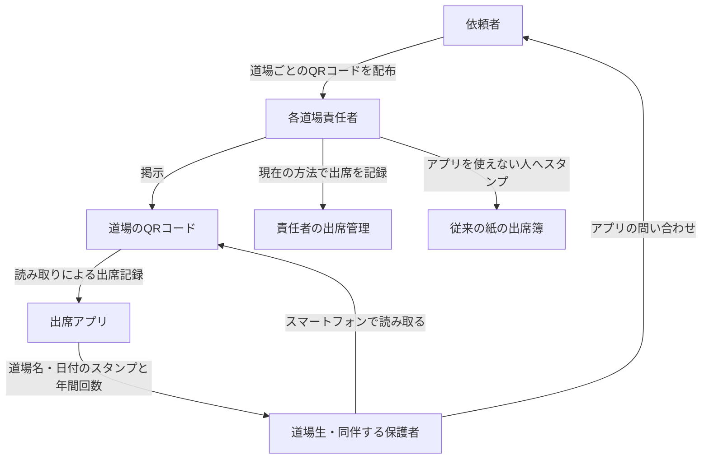

# 空手道場出席アプリの全体像（たたき台）

## 関係者と情報の流れ

- アプリは道場生・家族が自分の記録を見るために使う。責任者の出席管理との連携は初期版の対象外。
- 保護者のスマートフォンでは複数人の記録を分けて扱う。
- 約15道場・200名。利用料・開発費・運用費0円を希望。実現可能性は未検証。
- 導入時期と効果の確認方法は未決定。詳細な画面、技術、データ設計はこの図では定めない。

## 対応する資料

[企画書第0.2版](https://docs.google.com/document/d/1aF1DgGNbICm91RVcFGJmxwFJXk4o6nd_YSgn1BgfB1k)の「背景と目的」「利用者と規模」「初期版に含めたい内容」「今回の対象外と将来の検討」「運用の担当と企画の確認事項」を図示したもの。新たな要件の確定や正式Baselineではない。
